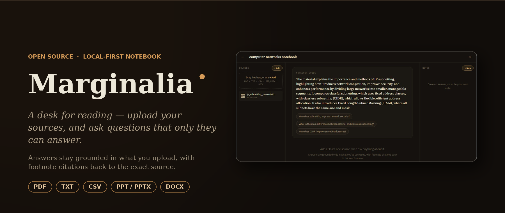

<p align="center">
  
</p>
<div align="center">

<h1> 📖 Marginalia </h1>

### A self-hosted, source-grounded research notebook powered by retrieval-augmented generation

*A desk for reading — upload your sources, and ask questions that only they can answer.*

[](https://www.python.org/)
[](https://fastapi.tiangolo.com/)
[](https://www.langchain.com/)
[](https://www.trychroma.com/)
[](https://mistral.ai/)
[](https://huggingface.co/)
[](https://www.sqlite.org/)
[](#)
[](https://www.uvicorn.org/)
[](#license)

</div>

---

## Overview

**Marginalia** is a self-hosted Retrieval-Augmented Generation (RAG) application for grounded, citable question-answering over your own documents. It extends a base LangChain + Chroma + Mistral pipeline into a full multi-notebook research workspace: isolated vector stores per notebook, multi-format ingestion, history-aware conversational retrieval, footnote-style citation grounding, and a "Studio" for capturing findings as notes.

The system is built around a strict grounding contract — every generated answer is required to be traceable back to a specific chunk in a specific source document, surfaced to the user as an inline, clickable footnote.

---

## Table of Contents

- [Features](#features)
- [Architecture](#architecture)
- [Tech Stack](#tech-stack)
- [Screenshots](#screenshots)
- [Project Structure](#project-structure)
- [API Reference](#api-reference)
- [Getting Started](#getting-started)
- [Configuration](#configuration)
- [Roadmap](#roadmap)
- [Contributing](#contributing)
- [License](#license)

---

## Features

- **Multi-notebook isolation** — Each notebook maintains its own scoped source set and a dedicated Chroma collection, preventing cross-contamination of embeddings and retrieval context between unrelated projects.
- **Multi-format ingestion pipeline** — Drag-and-drop upload for `PDF`, `TXT`, `CSV`, `PPT/PPTX`, and `DOCX`, parsed and normalized through a unified document loader prior to chunking.
- **History-aware conversational retrieval** — A condense-question step rewrites context-dependent follow-ups (e.g. *"what about chapter 3?"*) into standalone, retrieval-ready queries before they hit the vector store, so multi-turn conversations don't degrade retrieval quality.
- **Inline citation grounding** — Every claim in a generated answer is mapped back to its source chunk and rendered as a clickable footnote marker, surfacing the originating file and exact snippet on hover.
- **Persistent chat history** — Conversation state is persisted per notebook, with endpoints to fetch or clear history independently of the source set.
- **Studio notes** — Save any generated answer as a note in one click, or compose your own — notes persist alongside the notebook as first-class artifacts of your research.
- **Auto-generated notebook guide** — On source-set change, the backend regenerates a notebook-level abstract plus a set of suggested starter questions, giving immediate orientation into freshly uploaded material.
- **Fully self-hosted** — No managed vector DB, no third-party document store. Embeddings, vector storage, and chat metadata all run locally.

---

## Architecture

The retrieval path follows a standard but carefully sequenced RAG flow:

```
                 ┌────────────────────┐
  File Upload ──▶│  Document Loader   │  (pdf / txt / csv / pptx / docx parsers)
                 └─────────┬──────────┘
                           ▼
                 ┌────────────────────┐
                 │      Chunking      │  (recursive/semantic splitting)
                 └─────────┬──────────┘
                           ▼
                 ┌────────────────────┐
                 │  Embedding Model   │  (HuggingFace sentence embeddings)
                 └─────────┬──────────┘
                           ▼
                 ┌────────────────────┐
                 │   Chroma Vector    │  (one isolated collection per notebook)
                 │      Store         │
                 └─────────┬──────────┘
                           ▲
                           │  top-k retrieval
┌──────────┐   ┌───────────┴──────────┐    ┌──────────────────┐
│ User      │──▶│ Condense-Question   │──▶│  Retriever         │
│ Query     │   │ (history-aware)     │    │  (similarity/MMR)  │
└──────────┘   └──────────────────────┘    └─────────┬─────────┘
                                                       ▼
                                            ┌────────────────────┐
                                            │   Mistral LLM       │
                                            │  (grounded answer   │
                                            │  + citation spans)  │
                                            └─────────┬──────────┘
                                                       ▼
                                            ┌────────────────────┐
                                            │  Citation Mapper    │
                                            │ (chunk → footnote)  │
                                            └────────────────────┘
```

Chat and note metadata (notebook records, message history, saved notes) are persisted in **SQLite** (`app.db`), while embeddings live in a local **Chroma** persistence directory (`data/chroma-db`), keeping the entire stack dependency-free of any external managed service.

---

## Tech Stack

| Layer                | Technology                                                        |
|-----------------------|--------------------------------------------------------------------|
| API Framework         | FastAPI (ASGI, served via Uvicorn, OpenAPI 3.1 spec)               |
| Orchestration          | LangChain (retrieval chains, condense-question chain)             |
| LLM                    | Mistral                                                            |
| Embeddings             | HuggingFace sentence-embedding models                             |
| Vector Store           | ChromaDB (per-notebook collections, local persistence)            |
| Relational/Metadata DB | SQLite                                                             |
| Document Parsing       | PDF / DOCX / PPTX / CSV / TXT loaders                              |
| Frontend               | Vanilla JavaScript, HTML5, CSS3 (no framework dependency)         |
| Runtime                | Python 3.11+                                                       |

---

## Screenshots

### Notebooks dashboard
Landing view listing all notebooks, each isolated with its own source count and last-modified date.


### Grounded chat with inline citations
Answers are generated with footnote-style citation markers; hovering a marker surfaces the exact source file and snippet it was grounded in.


### Auto-generated notebook guide
On upload, the backend synthesizes a notebook-level abstract and a set of suggested starter questions derived from the source set.


### OpenAPI / Swagger reference
Full REST surface auto-documented via FastAPI's OpenAPI 3.1 schema generation.


### Project structure
Backend/frontend separation with a modular pipeline: loaders, chunking, embeddings, retrievers, and LLM orchestration as discrete units.


---

## Project Structure

```
notebook-rag/
├── backend/
│   ├── app/
│   │   ├── __init__.py
│   │   ├── main.py            # FastAPI app entrypoint & route registration
│   │   ├── config.py          # environment / settings management
│   │   ├── db.py               # SQLite connection & session handling
│   │   ├── schemas.py          # Pydantic request/response models
│   │   ├── documentloader.py   # multi-format document parsing (pdf/docx/pptx/csv/txt)
│   │   ├── chunking.py         # text splitting / chunk strategy
│   │   ├── embeddings.py       # HuggingFace embedding model wrapper
│   │   ├── retrievers.py       # per-notebook Chroma retrievers, condense-question chain
│   │   └── llm.py              # Mistral LLM client & prompt construction
│   ├── data/
│   │   ├── chroma-db/          # persisted vector store (per-notebook collections)
│   │   └── uploads/            # raw uploaded source files
│   ├── app.db                  # SQLite metadata store (notebooks, chat, notes)
│   ├── requirements.txt
│   └── .env
└── frontend/
    ├── index.html
    ├── app.js                  # notebook UI, chat composer, citation rendering
    └── style.css
```

---

## API Reference

All endpoints are served under `/api` and fully documented via the auto-generated OpenAPI schema at `/docs`.

| Method   | Endpoint                                          | Description                          |
|----------|----------------------------------------------------|---------------------------------------|
| `GET`    | `/api/notebooks`                                   | List all notebooks                    |
| `POST`   | `/api/notebooks`                                   | Create a new notebook                 |
| `GET`    | `/api/notebooks/{notebook_id}`                     | Get notebook detail                   |
| `PATCH`  | `/api/notebooks/{notebook_id}`                     | Rename a notebook                     |
| `DELETE` | `/api/notebooks/{notebook_id}`                     | Delete a notebook                     |
| `POST`   | `/api/notebooks/{notebook_id}/sources`             | Upload source file(s)                 |
| `GET`    | `/api/notebooks/{notebook_id}/sources`             | List sources in a notebook            |
| `DELETE` | `/api/notebooks/{notebook_id}/sources/{source_id}` | Delete a source                       |
| `GET`    | `/api/notebooks/{notebook_id}/chat`                | Get chat history                      |
| `POST`   | `/api/notebooks/{notebook_id}/chat`                | Send a chat message (RAG query)       |
| `DELETE` | `/api/notebooks/{notebook_id}/chat`                | Clear chat history                    |
| `GET`    | `/api/notebooks/{notebook_id}/notes`               | List saved notes                      |
| `POST`   | `/api/notebooks/{notebook_id}/notes`               | Create a note                         |
| `DELETE` | `/api/notebooks/{notebook_id}/notes/{note_id}`     | Delete a note                         |
| `GET`    | `/api/health`                                      | Health check                          |

---

## Getting Started

### Prerequisites

- Python 3.11+
- `pip` / `venv`
- A Mistral API key (or a locally served Mistral endpoint, depending on your `llm.py` configuration)
- *(Optional)* A HuggingFace access token, for higher-rate-limit embedding model downloads

### Backend setup

```bash
# clone the repo
git clone https://github.com/<your-username>/marginalia.git
cd marginalia/backend

# create and activate a virtual environment
python -m venv .venv
source .venv/bin/activate      # Windows: .venv\Scripts\activate

# install dependencies
pip install -r requirements.txt

# configure environment variables
cp .env.example .env           # then fill in your values, see Configuration below

# run the API
uvicorn app.main:app --reload
```

The API will be available at `http://127.0.0.1:8000`, with interactive Swagger docs at `http://127.0.0.1:8000/docs`.

### Frontend setup

The frontend is a static, dependency-free client — serve it with any static file server:

```bash
cd ../frontend
python -m http.server 5500
# or use the VS Code "Live Server" extension
```

Visit `http://127.0.0.1:5500` in your browser.

---

## Configuration

Environment variables are managed via `backend/.env`. Adjust to match your actual `config.py`:

```env
# LLM
MISTRAL_API_KEY=your-mistral-api-key

# Embeddings
HF_TOKEN=your-huggingface-token          # optional, raises HF Hub rate limits
EMBEDDING_MODEL=sentence-transformers/all-MiniLM-L6-v2

# Storage
CHROMA_DB_DIR=./data/chroma-db
UPLOADS_DIR=./data/uploads
DATABASE_URL=sqlite:///./app.db
```

> Update these keys to match the exact variable names read in `backend/app/config.py`.

---

## Roadmap

- [ ] Streaming token responses over SSE/WebSocket
- [ ] Source-level re-ranking (cross-encoder) before generation
- [ ] Export notebook (sources + notes + chat) to Markdown/PDF
- [ ] Multi-user auth & per-user notebook scoping
- [ ] Swap-in support for alternate LLM backends (Ollama, OpenAI-compatible endpoints)

---

## Contributing

Contributions, issues, and feature requests are welcome. Feel free to check the [issues page](../../issues) or open a pull request.

1. Fork the repo
2. Create your feature branch (`git checkout -b feature/amazing-feature`)
3. Commit your changes (`git commit -m 'Add amazing feature'`)
4. Push to the branch (`git push origin feature/amazing-feature`)
5. Open a pull request

---

## License

Distributed under the MIT License. See `LICENSE` for more information.

---

<div align="center">

Built with LangChain, Chroma, and Mistral — self-hosted, source-grounded, citation-first.

</div>
